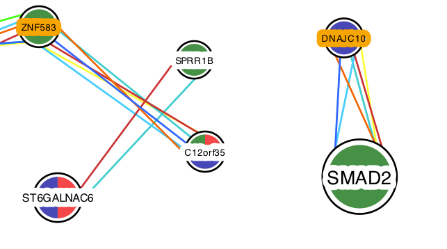

---
output:
  html_document: default
  pdf_document:
    fig_crop: no
    fig_height: 4
    fig_width: 7
    toc_depth: 0
---

**Colors, shapes and sizes**

The size of the node corresponds to the fold change value for that node.  Where there is more that one virus and or time point for a given node, the size defaults to the smallest.   The sign of the fold change value is indicated by the outline color for the name on the node: White for positive and Orange for Negative.  This means that as the slider for the fold change cut off value is changed, the same node on the plot may get larger or smaller depending on which viruses and time points meet the selection criteria and what their fold change values are for that node.  Fo unambiguity in the sign and size, choose only one virus, one time point and leave "Show unselected viruses that also occur on nodes in this network?" unchecked.

Green, red and blue are used as node colors to indicate the corresponding virus(es) for the nodes.  The shape of the node indicates what kind of entity it is:  gene = round, protein = hexagon (more will be addeds)

The edges are color coded to checkboxes and labels in the user selection pane.

Still confused?  shoot us an email at fluomics.modeling@gmail.com 

